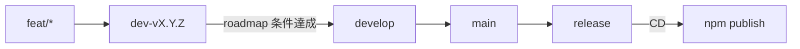

# リポジトリ運用・ブランチ・CI/CD

Playground の公開面、Git ブランチ戦略、CI/CD、docs 系バージョンの運用を定める。  
ライブラリ製品仕様の正は [specs/](./specs/)。本ファイルは **リポジトリ運用の正**。

関連: [playground.md](./playground.md) / [roadmap.md](./roadmap.md) / [need_decision.md](./need_decision.md) / [development.md](./development.md)

---

## バージョン（docs トラック）

本節以降の「Playground 公開・ブランチ整備・CI/CD」など **リポジトリ／ドキュメント／配布導線** の作業は、次の版系列で進める。

| 項目 | 方針 |
|------|------|
| 形式 | **`v0.10.0-docs.n`**（`n` は 1 からインクリメント） |
| 意味 | `v0.10.0` 製品線上の **docs / インフラ / 導線** 向けマーカー。機能 MINOR（`v0.11.0` 等）とは別トラック |
| git tag | 作業単位の区切りで **`v0.10.0-docs.n`** を付与してよい |
| npm | **docs タグだけでは publish しない**。npm 公開は後述の **`release` ブランチへのマージ**（および tag ↔ version 一致）に限定 |
| ライブラリ `package.json` | docs 作業のみでは **上げない**（機能／パッケージリリース時に SemVer を上げる） |

機能開発の SemVer（`v0.n.0` / PATCH）は従来どおり [roadmap.md](./roadmap.md)「バージョン運用メモ」に従う。

---

## 長期ブランチ

| ブランチ | 役割 |
|----------|------|
| **`develop`** | 現行どおりの統合・開発のハブ。マイルストーン完了物を受け取る |
| **`main`** | **いつでもリリース可能な状態**を保つブランチ。安定版の正 |
| **`release`** | **実際に npm へ出すパッケージ**のためのブランチ。ここへのマージが CD のトリガ |

初期化時は、現状の安定点（例: `v0.10.0` 相当の `develop`）から `main` / `release` を作成する（実施済み。履歴は [_archive/roadmap/v0.10.0-docs.md](./_archive/roadmap/v0.10.0-docs.md)）。

---

## バージョン開発ブランチ

| ブランチ | 命名例 | 役割 |
|----------|--------|------|
| マイルストーン開発 | **`dev-v{major}.{minor}.{patch}`**（例: `dev-v0.11.0`） | その版の roadmap 条件を満たすまでの作業統合先 |
| 機能 | **`feat/...`**（またはチーム慣例の feat 接頭） | 1 機能単位。**`dev-v…` へマージ**する |
| ドキュメント／導線 | **`docs/...`** または docs トラック用ブランチ | 原則は通常フロー。**例外として `main` へ直接マージ可**（後述） |
| 緊急修正 | **`hotfix/...`** | **`main` へ入れたうえで `release` へマージ**する場合がある（後述） |

---

## 通常のマージフロー（機能リリース）

前提: 対象マイルストーンの開発ブランチを `dev-v{n}.{n}.{n}` とする。

1. **`feat/*` → `dev-vX.Y.Z`**  
   機能ごとにブランチを切り、マイルストーン開発ブランチへ統合する。
2. **`dev-vX.Y.Z` → `develop`**  
   [roadmap.md](./roadmap.md) 上、当該版の受け入れ条件を満たしたら `develop` へマージする。
3. **`develop` → `main`**  
   リリース候補を安定ブランチへ載せる。
4. **`main` → `release`**  
   パッケージとして出すタイミングで `release` へマージする。
5. **`release` へのマージ → npm publish（CD）**  
   後述。

`develop` 自体の役割・運用は **現状維持**（日々の統合ハブ）。

---

## 例外フロー

### docs 系

- ドキュメント・README・導線・リポジトリ運用のみの変更は、**`main` へ直接マージしてよい**場合がある。
- その場合も、必要なら後続で `main` → `release` は行わない（npm に影響しない変更）／行う（配布物 README を npm に載せたいとき）を判断する。
- docs トラックの版付けは **`v0.10.0-docs.n`**。

### hotfix

- 緊急修正は **`main` に入れたうえで `release` へマージ**する場合がある。
- `release` へ入れば通常どおり CD で npm 公開対象になる（版番号・tag 方針はリリース時に SemVer で決める）。

### `main` への直接マージ禁止

- **通常、`main` への直接マージは禁止**する（PR 経由でも、原則は `develop` → `main` または許可された docs / hotfix 経路）。
- **例外:** GitHub ユーザー **`@kohki-shikata`** が **force push** した場合は、直接更新を受け入れる（運用上のエスケープハッチ）。

---

## Playground / ドキュメントサイトの公開（Netlify）

製品仕様: [docs-site.md](./docs-site.md)。

| 項目 | 方針 |
|------|------|
| サイト | **`docs-site/`**（Nuxt Content）。Playground は **`/playground`** に統合済み |
| テーマ | dark / light / system をサイトと Playground で共有 |
| デプロイ | **`main`**。根 `netlify.toml` で `app/` + `docs-site/` をビルド |
| URL | **https://hyogen-md.netlify.app**（Playground: `/playground`） |
| npm | サイト・Playground とも **含めない** |

### Netlify 接続手順（参照用）

1. [Netlify](https://app.netlify.com/) で **Add new site → Import an existing project**
2. GitHub の **`b4m-oss/hyogen-md`** を選択
3. Branch: **`main`**。Build settings はリポジトリ根の `netlify.toml` を使用
4. Site name を **`hyogen-md`**（URL: `https://hyogen-md.netlify.app`）にする。取れない場合は別名にし README を更新
5. Deploy。以降 `main` への push で自動デプロイ

---

## CI（GitHub Actions）

| トリガ | 対象 |
|--------|------|
| **GitHub PR** | base が **`dev-v*`**（`dev-v0.11.0` 等） |
| **GitHub PR** | base が **`develop`** |

Workflow: [`.github/workflows/ci.yml`](../.github/workflows/ci.yml)

- `make check`（app typecheck / build / test / pack）
- `make test-pg`（docs-site 内 Playground テスト）
- `make build-docs`（docs-site 静的生成）

---

## CD（npm publish）

| 項目 | 方針 |
|------|------|
| トリガ | **`release` への push**（マージ含む） |
| Workflow | [`.github/workflows/publish.yml`](../.github/workflows/publish.yml) |
| 動作 | `app/` で build のあと `npm publish --access public` |
| 既存版 | registry に **同じ `name@version` がある場合は publish をスキップ**（成功終了）。初期 `release` = `0.10.0` でも再公開しない |
| 版 | git tag と `app/package.json` の version を **一致**させてから `release` へ載せる |
| Secret | リポジトリ Secrets に **`NPM_TOKEN`**（npm Automation / Granular Access Token。`@b4moss` への publish 権限） |

### NPM_TOKEN の登録手順

1. [npmjs.com](https://www.npmjs.com/) で Access Token を発行（Automation 推奨）
2. GitHub リポジトリ **Settings → Secrets and variables → Actions**
3. Name: `NPM_TOKEN`、Value: トークンを保存
4. 対象リポジトリは **`b4m-oss/hyogen-md`**（github リモートを正とする）

初回公開済みの前提・パッケージ境界は [need_decision.md](./need_decision.md)「配布・公開」。

---

## ブランチ保護・権限

対象は **GitHub `b4m-oss/hyogen-md`**（社内 `origin` はブランチ同期のみでよい）。

| ブランチ | 設定 |
|----------|------|
| `main` | PR 必須。**Allow force pushes = ON**（クラシック保護。意図する利用者は **`@kohki-shikata`**。書き込み権限のある他ユーザーも force push 可能な点に注意。Rulesets でアクター限定できる場合はそちらへ移行） |
| `release` | PR 必須。force push 不可。マージ後の push で CD 起動 |
| `develop` | PR 必須。force push 不可。CI 安定後に status check **`app + playground`** を Require に追加推奨 |

---

## まとめ（チェックリスト）

- [x] 長期ブランチ `main` / `release` を用意（`develop` は維持）
- [x] 以降の機能は `feat/*` → `dev-vX.Y.Z` → `develop` → `main` → `release`（方針確定）
- [x] docs は `v0.10.0-docs.n`。必要なら `main` 直マージ可（方針確定）
- [x] hotfix は `main` → `release` 可（方針確定）
- [x] CI: PR → `dev-v*` / `develop`（`.github/workflows/ci.yml`）
- [x] CD: `release` マージ → npm publish（`.github/workflows/publish.yml` + 既存版スキップ）
- [x] Playground を Netlify 公開し、README から導線（`netlify.toml` + `https://hyogen-md.netlify.app`。サイト接続はダッシュボード手順）
- [ ] ドキュメントサイト（docs.5〜8）: Nuxt Content・Playground 内包・テーマ・API/構文網羅 → [docs-site.md](./docs-site.md)

以上
