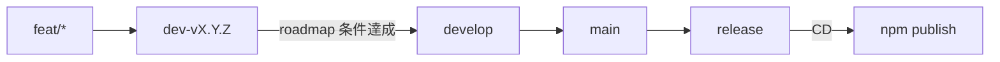

# リポジトリ運用・ブランチ・CI/CD

Playground の公開面、Git ブランチ戦略、CI/CD、docs 系バージョンの運用を定める。  
ライブラリ製品仕様の正は [specs/](./specs/)。本ファイルは **リポジトリ運用の正**。

関連: [playground.md](./playground.md) / [roadmap.md](./roadmap.md) / [need_decision.md](./need_decision.md) / [development.md](./development.md)

---

## バージョン（docs トラック）

本節以降の「Playground 公開・ブランチ整備・CI/CD」など **リポジトリ／ドキュメント／配布導線** の作業は、次の版系列で進める。

| 項目 | 方針 |
|------|------|
| 形式 | **`v0.10.0-docs.n`**（`n` は 1 からインクリメント） |
| 意味 | `v0.10.0` 製品線上の **docs / インフラ / 導線** 向けマーカー。機能 MINOR（`v0.11.0` 等）とは別トラック |
| git tag | 作業単位の区切りで **`v0.10.0-docs.n`** を付与してよい |
| npm | **docs タグだけでは publish しない**。npm 公開は後述の **`release` ブランチへのマージ**（および tag ↔ version 一致）に限定 |
| ライブラリ `package.json` | docs 作業のみでは **上げない**（機能／パッケージリリース時に SemVer を上げる） |

機能開発の SemVer（`v0.n.0` / PATCH）は従来どおり [roadmap.md](./roadmap.md)「バージョン運用メモ」に従う。

---

## 長期ブランチ

| ブランチ | 役割 |
|----------|------|
| **`develop`** | 現行どおりの統合・開発のハブ。マイルストーン完了物を受け取る |
| **`main`** | **いつでもリリース可能な状態**を保つブランチ。安定版の正 |
| **`release`** | **実際に npm へ出すパッケージ**のためのブランチ。ここへのマージが CD のトリガ |

初期化時は、現状の安定点（例: `v0.10.0` 相当の `develop`）から `main` / `release` を作成する（実装手順は roadmap の docs 節）。

---

## バージョン開発ブランチ

| ブランチ | 命名例 | 役割 |
|----------|--------|------|
| マイルストーン開発 | **`dev-v{major}.{minor}.{patch}`**（例: `dev-v0.11.0`） | その版の roadmap 条件を満たすまでの作業統合先 |
| 機能 | **`feat/...`**（またはチーム慣例の feat 接頭） | 1 機能単位。**`dev-v…` へマージ**する |
| ドキュメント／導線 | **`docs/...`** または docs トラック用ブランチ | 原則は通常フロー。**例外として `main` へ直接マージ可**（後述） |
| 緊急修正 | **`hotfix/...`** | **`main` へ入れたうえで `release` へマージ**する場合がある（後述） |

---

## 通常のマージフロー（機能リリース）

前提: 対象マイルストーンの開発ブランチを `dev-v{n}.{n}.{n}` とする。

1. **`feat/*` → `dev-vX.Y.Z`**  
   機能ごとにブランチを切り、マイルストーン開発ブランチへ統合する。
2. **`dev-vX.Y.Z` → `develop`**  
   [roadmap.md](./roadmap.md) 上、当該版の受け入れ条件を満たしたら `develop` へマージする。
3. **`develop` → `main`**  
   リリース候補を安定ブランチへ載せる。
4. **`main` → `release`**  
   パッケージとして出すタイミングで `release` へマージする。
5. **`release` へのマージ → npm publish（CD）**  
   後述。

`develop` 自体の役割・運用は **現状維持**（日々の統合ハブ）。

---

## 例外フロー

### docs 系

- ドキュメント・README・導線・リポジトリ運用のみの変更は、**`main` へ直接マージしてよい**場合がある。
- その場合も、必要なら後続で `main` → `release` は行わない（npm に影響しない変更）／行う（配布物 README を npm に載せたいとき）を判断する。
- docs トラックの版付けは **`v0.10.0-docs.n`**。

### hotfix

- 緊急修正は **`main` に入れたうえで `release` へマージ**する場合がある。
- `release` へ入れば通常どおり CD で npm 公開対象になる（版番号・tag 方針はリリース時に SemVer で決める）。

### `main` への直接マージ禁止

- **通常、`main` への直接マージは禁止**する（PR 経由でも、原則は `develop` → `main` または許可された docs / hotfix 経路）。
- **例外:** GitHub ユーザー **`@kohki-shikata`** が **force push** した場合は、直接更新を受け入れる（運用上のエスケープハッチ）。

---

## Playground の公開（Netlify）

| 項目 | 方針 |
|------|------|
| ホスティング | **Netlify** に Playground を公開する |
| npm | **引き続きパッケージに含めない**（[playground.md](./playground.md)） |
| 利用者導線 | リポジトリ根および `app/` の **[README.md](../README.md) / [README_ja.md](../README_ja.md)** から公開 URL へリンクする |
| デプロイ元 | **`main`**（production branch）。ビルド設定はリポジトリ根 `netlify.toml` |
| URL | 初回デプロイ後に確定し README へ記載 |

製品 UI 仕様は [playground.md](./playground.md)。

---

## CI（GitHub Actions 想定）

| トリガ | 対象 |
|--------|------|
| **GitHub PR** | base が **`dev-v*`**（`dev-v0.11.0` 等） |
| **GitHub PR** | base が **`develop`** |

実施内容（最低）:

- `app/`: typecheck / test / build（既存 `make check` 相当を目標）
- 必要に応じて `playground/` の test / build

`main` / `release` への PR や push での CI 追加は後続でよい（本仕様の必須は上表）。

---

## CD（npm publish）

| 項目 | 方針 |
|------|------|
| トリガ | **`release` ブランチへマージされたとき** |
| 動作 | `@b4moss/hyogen-md` を **npm publish**（`app/`。`publishConfig.access: public`） |
| 版 | git tag と `app/package.json` の version を **一致**させる（従来方針） |
| 注意 | docs のみ・Playground のみの変更で誤 publish しないよう、`release` へ載せる内容と version bump をリリース手順で明示する |

初回公開済みの前提・パッケージ境界は [need_decision.md](./need_decision.md)「配布・公開」。

---

## ブランチ保護・権限（方針）

実装は GitHub の branch protection / Rulesets で行う。

| ルール | 内容 |
|--------|------|
| `main` | 直接マージ禁止をルール化。例外は **`@kohki-shikata` の force push 受け入れ** |
| `release` | 不用意な直接 push を制限。マージ＋CD を前提 |
| `develop` / `dev-v*` | PR + CI 必須を推奨 |

---

## まとめ（チェックリスト）

- [x] 長期ブランチ `main` / `release` を用意（`develop` は維持）
- [x] 以降の機能は `feat/*` → `dev-vX.Y.Z` → `develop` → `main` → `release`（方針確定）
- [x] docs は `v0.10.0-docs.n`。必要なら `main` 直マージ可（方針確定）
- [x] hotfix は `main` → `release` 可（方針確定）
- [x] CI: PR → `dev-v*` / `develop`（`.github/workflows/ci.yml`）
- [ ] CD: `release` マージ → npm publish
- [ ] Playground を Netlify 公開し、README から導線

以上
